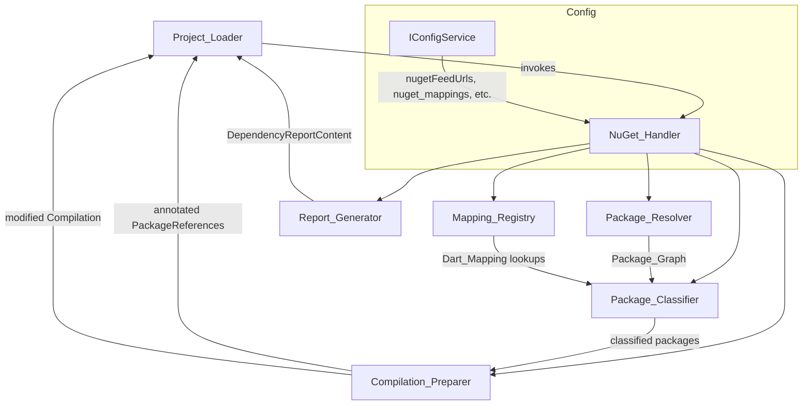
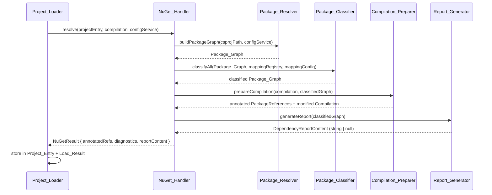

# NuGet Dependency Handling — Design Document

## Overview

The NuGet dependency handling subsystem (`NuGet_Handler`) is an internal sub-component of the
`Project_Loader` stage. It is not a top-level pipeline stage; the Orchestrator never invokes it
directly. Instead, the `Project_Loader` calls the `NuGet_Handler` during package reference
resolution, and all `NR`-prefixed diagnostics it emits flow into `Load_Result.Diagnostics`.

The subsystem has three primary responsibilities:

1. **Resolution** — Parse `.csproj`/`.sln` files, resolve the full transitive NuGet dependency
   graph (using the local cache or configured feeds), and produce a deterministic `Package_Graph`.

2. **Classification** — Assign each resolved package to one of three handling tiers by consulting
   the built-in `Mapping_Registry` and any user-supplied `Mapping_Config` overrides from
   `transpiler.yaml`.

3. **Roslyn Compilation Preparation** — Add `.dll` metadata references (Tier 1) and C#
   `SyntaxTree` objects (Tier 2) to the Roslyn `Compilation` before it is handed to the
   `IR_Builder`; annotate each `Project_Entry.PackageReferences` entry with its resolved `Tier`
   and `DartMapping`; and produce the `DependencyReportContent` string that flows through the
   pipeline to the `Result_Collector`.

### Key Design Decisions

- **Sub-component, not a stage.** The NuGet_Handler is invoked by the `Project_Loader` and its
  outputs are embedded in `Load_Result`. This keeps the Orchestrator's stage wiring simple and
  ensures NuGet diagnostics appear between `PL`-prefixed and `RF`-prefixed entries in the final
  diagnostic list.

- **Mapping_Registry as versioned YAML.** The built-in registry is a YAML file bundled with the
  transpiler binary. This makes it easy to inspect, diff, and update without recompiling. User
  overrides via `nuget_mappings` in `transpiler.yaml` are merged at startup with user entries
  taking precedence.

- **DependencyReportContent as a pipeline-carried string.** The NuGet_Handler produces the
  markdown content and places it on `Project_Entry`; downstream stages propagate it unchanged
  through `IR_Build_Result` and `Gen_Result`; the `Result_Collector` writes it to disk. This
  avoids any direct file I/O in the NuGet_Handler and keeps the write responsibility with the
  Result_Collector.

- **Tier 2 transpilation via recursive pipeline invocation.** When a package is Tier 2, its C#
  source is injected into the same Roslyn `Compilation` as the host project. This reuses the
  existing IR_Builder and Dart_Generator machinery rather than duplicating it.

- **Offline-first resolution.** The NuGet_Handler prefers the local cache over network requests,
  enabling reproducible builds in air-gapped environments.

---

## Architecture

The NuGet_Handler is composed of five collaborating sub-components:



### Sub-component Responsibilities

| Sub-component | Responsibility |
|---|---|
| `Package_Resolver` | Parses project files; resolves transitive graph via NuGet protocol; handles CPM, floating versions, offline cache |
| `Package_Classifier` | Assigns Tier 1/2/3 to each resolved package by consulting `Mapping_Registry` and `Mapping_Config` |
| `Mapping_Registry` | Loads and merges the built-in YAML registry with user overrides; validates entries at startup |
| `Compilation_Preparer` | Adds `.dll` references (Tier 1) and `SyntaxTree` objects (Tier 2) to the Roslyn `Compilation`; annotates `PackageReferences` |
| `Report_Generator` | Produces the `DependencyReportContent` markdown string |

### Invocation Sequence



---

## Components and Interfaces

### NuGet_Handler (entry point)

```dart
/// Entry point invoked by Project_Loader for each Project_Entry.
abstract class INuGetHandler {
  /// Resolves, classifies, and prepares all NuGet dependencies for [projectEntry].
  /// Mutates [compilation] by adding metadata references and syntax trees.
  /// Returns a [NuGetResult] carrying annotated package references, diagnostics,
  /// and the dependency report content string.
  NuGetResult resolve({
    required ProjectEntry projectEntry,
    required CSharpCompilation compilation,
    required IConfigService configService,
  });
}

class NuGetResult {
  /// Annotated package references to store on Project_Entry.PackageReferences.
  final List<PackageReferenceEntry> annotatedReferences;

  /// NR-prefixed diagnostics to merge into Load_Result.Diagnostics.
  final List<Diagnostic> diagnostics;

  /// Markdown content for dependency_report.md, or null when no packages resolved.
  final String? dependencyReportContent;

  const NuGetResult({
    required this.annotatedReferences,
    required this.diagnostics,
    required this.dependencyReportContent,
  });
}
```

### Package_Resolver

```dart
abstract class IPackageResolver {
  /// Builds the full transitive Package_Graph for the given project file.
  /// Reads feed URLs from [configService.nugetFeedUrls].
  /// Prefers local cache (nuget_cache_path from config) over network.
  Future<PackageGraphResult> buildPackageGraph({
    required String csprojPath,
    required IConfigService configService,
  });
}

class PackageGraphResult {
  final List<ResolvedPackage> packages; // topologically sorted, direct + transitive
  final List<Diagnostic> diagnostics;
}

class ResolvedPackage {
  final String id;
  final String resolvedVersion;
  final bool isDirect;
  final List<String> requestedBy; // package IDs that depend on this one
  PackageTier? tier; // set by Package_Classifier
  DartMapping? dartMapping; // set by Package_Classifier
}
```

### Package_Classifier

```dart
abstract class IPackageClassifier {
  /// Classifies each package in [graph] into Tier 1, 2, or 3.
  /// Mutates [ResolvedPackage.tier] and [ResolvedPackage.dartMapping] in place.
  ClassificationResult classify({
    required List<ResolvedPackage> packages,
    required MappingRegistry registry,
    required MappingConfig config,
  });
}

class ClassificationResult {
  final List<ResolvedPackage> classifiedPackages;
  final List<Diagnostic> diagnostics;
}
```

### Mapping_Registry

```dart
abstract class IMappingRegistry {
  /// Loads the built-in registry YAML and merges [userOverrides] on top.
  /// Validates all entries; emits NR-prefixed Error diagnostics for invalid entries.
  static MappingRegistry load({
    required Map<String, dynamic> userOverrides, // from transpiler.yaml nuget_mappings
    String? externalRegistryPath,               // from mapping_registry_path config key
  });

  /// Returns the Dart_Mapping for [packageId] at [resolvedVersion], or null.
  DartMapping? lookup(String packageId, String resolvedVersion);

  /// Returns all active entries (built-in + user overrides).
  List<MappingEntry> allEntries();
}

class MappingEntry {
  final String packageId;
  final String versionRange;   // NuGet version range string
  final String dartPackage;
  final String dartVersionConstraint;
  final String? shimPath;
  final PackageTier tier;
}

class DartMapping {
  final String dartPackage;
  final String dartVersionConstraint;
  final String? shimPath;
  final PackageTier tier;
}
```

### Compilation_Preparer

```dart
abstract class ICompilationPreparer {
  /// Adds metadata references (Tier 1) and syntax trees (Tier 2) to [compilation].
  /// Returns the annotated PackageReferenceEntry list and any diagnostics.
  CompilationPreparationResult prepare({
    required CSharpCompilation compilation,
    required List<ResolvedPackage> classifiedPackages,
    required IConfigService configService,
  });
}

class CompilationPreparationResult {
  final List<PackageReferenceEntry> annotatedReferences;
  final List<Diagnostic> diagnostics;
}

/// Corresponds to Project_Entry.PackageReferences entries.
class PackageReferenceEntry {
  final String packageName;
  final String version;
  final PackageTier tier;
  final DartMapping? dartMapping;
}
```

### Report_Generator

```dart
abstract class IReportGenerator {
  /// Produces the dependency_report.md content string.
  /// Returns null when [classifiedPackages] is empty.
  String? generate(List<ResolvedPackage> classifiedPackages);
}
```

### Version Constraint Translator

```dart
abstract class IVersionConstraintTranslator {
  /// Translates a NuGet version range string to a Dart pub version constraint.
  VersionTranslationResult translate(String nugetVersionRange);
}

class VersionTranslationResult {
  final String dartConstraint;
  final bool isExact;
  final Diagnostic? warning; // emitted when no direct equivalent exists
}
```

---

## Data Models

### PackageTier

```dart
enum PackageTier {
  tier1, // known mapping to Dart SDK or pub.dev package
  tier2, // source-available, transpiled by the pipeline
  tier3, // no mapping, no source — stub generated
}
```

### MappingConfig (parsed from transpiler.yaml)

The NuGet_Handler reads the following keys from `IConfigService`. Keys marked **new** are not yet
in the Transpiler Configuration spec and must be added there:

| YAML key | IConfigService accessor | Type | Default | Status |
|---|---|---|---|---|
| `nuget_feeds` | `nugetFeedUrls` | `List<String>` | `["https://api.nuget.org/v3/index.json"]` | Existing |
| `package_mappings` | `packageMappings` | `Map<String, String>` | `{}` | Existing (name→name only) |
| `nuget_mappings` | `nugetMappings` | `Map<String, dynamic>` | `{}` | **New** — full registry override entries |
| `nuget_cache_path` | `nugetCachePath` | `String?` | `null` | **New** |
| `tier2_source_paths` | `tier2SourcePaths` | `List<String>` | `[]` | **New** |
| `exclude_packages` | `excludePackages` | `List<String>` | `[]` | **New** |
| `force_tier` | `forceTier` | `Map<String, int>` | `{}` | **New** |
| `transpile_tier2` | `transpileTier2` | `bool` | `true` | **New** |
| `mapping_registry_path` | `mappingRegistryPath` | `String?` | `null` | **New** |

> **Note:** The new keys listed above must be added to the Transpiler Configuration specification
> (`IConfigService`) before implementation. The `nuget_mappings` key is distinct from
> `package_mappings`: `package_mappings` maps NuGet package names to Dart package names (simple
> string→string), while `nuget_mappings` carries full `MappingEntry` records (version range, shim
> path, tier override, etc.).

### Package_Graph node

```dart
class ResolvedPackage {
  final String id;                  // NuGet package ID (case-insensitive, stored lowercase)
  final String resolvedVersion;     // semver string, e.g. "13.0.3"
  final bool isDirect;              // true if in <PackageReference> of the root project
  final List<String> requestedBy;   // IDs of packages that depend on this one
  PackageTier? tier;                // null until classified
  DartMapping? dartMapping;         // null for Tier 2 and Tier 3
  String? sourceLocation;           // local path to .nupkg or source tree (Tier 2 only)
}
```

### Diagnostic codes (NR prefix)

| Code | Severity | Condition |
|---|---|---|
| `NR0001` | Error | Package cannot be resolved from any configured feed or cache |
| `NR0002` | Error | Version conflict — no version satisfies all constraints |
| `NR0003` | Error | Mapping_Registry entry is invalid (bad version range, missing fields, invalid pub ID) |
| `NR0004` | Error | Tier 1 assembly cannot be located; package downgraded to Tier 3 |
| `NR0005` | Error | Tier 2 source cannot be located; package downgraded to Tier 3 |
| `NR0006` | Error | Dart version constraint is syntactically invalid |
| `NR0007` | Warning | Tier 1 package version outside supported mapping range |
| `NR0008` | Warning | Tier 3 package — stub generated |
| `NR0009` | Warning | User mapping entry omits `dart_version_constraint`; using `any` |
| `NR0010` | Warning | NuGet version range has no direct Dart equivalent; widest covering constraint used |
| `NR0011` | Warning | Tier 2 package contains unsupported construct (P/Invoke, unsafe, DllImport) |
| `NR0012` | Info | Package classified (one per package, lists tier and reason) |
| `NR0013` | Info | All dependencies resolved successfully |

### DependencyReportContent schema

The `Report_Generator` produces a markdown string conforming to the schema defined in
Requirement 10.1. The string is stored on `Project_Entry` as a plain `String?` field named
`dependencyReportContent`, propagated through `IR_Build_Result` and `Gen_Result` as
`Dart_Package.DependencyReportContent`, and written to disk by the `Result_Collector` as
`dependency_report.md`.

### Version constraint translation table

| NuGet range | Dart constraint | Notes |
|---|---|---|
| `[1.2.0,)` | `^1.2.0` | Standard caret (major ≥ 1) |
| `[0.5.0,)` | `>=0.5.0` | Caret not used for major = 0 |
| `[1.2.3]` | `1.2.3` | Exact pin |
| `[1.0.0, 2.0.0)` | `>=1.0.0 <2.0.0` | Upper-bounded range |
| `(1.0.0,)` | `>1.0.0` | Exclusive lower bound |
| Non-contiguous | widest covering + `NR0010` warning | No direct equivalent |

### pubspec.yaml structure

```yaml
name: <snake_case_project_name>
description: "Generated by cs2dart from <ProjectName>"
version: 1.0.0
environment:
  sdk: ">=<min_dart_sdk> <4.0.0"

dependencies:
  # Tier 1 mapped packages (sorted alphabetically)
  dart_package_name: "^x.y.z"
  # Tier 2 path dependencies
  tier2_package_id:
    path: lib/src/packages/tier2_package_id
  # Tier 3 stubs (with TODO comment)
  # TODO: replace stub
  tier3_package_id:
    path: lib/src/stubs/tier3_package_id.dart

dev_dependencies:
  # Packages with PrivateAssets="all"
  dev_only_package: "^x.y.z"
```

### Output directory layout

```
<output_package_root>/
├── pubspec.yaml
├── dependency_report.md          # written by Result_Collector from DependencyReportContent
├── lib/
│   └── src/
│       ├── shims/                # API shims for Tier 1 packages with shim_path
│       │   └── <package_id>_shim.dart
│       ├── packages/             # transpiled Dart output for Tier 2 packages
│       │   └── <package_id>/
│       │       └── *.dart
│       └── stubs/                # Compatibility_Stub files for Tier 3 packages
│           └── <package_id>.dart
```


## Correctness Properties

*A property is a characteristic or behavior that should hold true across all valid executions of a
system — essentially, a formal statement about what the system should do. Properties serve as the
bridge between human-readable specifications and machine-verifiable correctness guarantees.*

### Property 1: Package extraction completeness

*For any* valid `.csproj` file containing N `<PackageReference>` elements, the NuGet_Handler SHALL
extract exactly N package references, each carrying the correct `Include` (package ID) and
`Version` attribute values.

**Validates: Requirements 1.1, 1.2**

---

### Property 2: Direct reference preservation

*For any* valid `.csproj` file, every package ID listed as a direct `<PackageReference>` SHALL
appear in the resolved `Package_Graph` with `isDirect = true`.

**Validates: Requirements 2.6, 14.1**

---

### Property 3: Transitive closure completeness

*For any* Package_Graph, every package that is a transitive dependency of a direct reference SHALL
appear as a node in the resolved graph (the graph is the full transitive closure, not just direct
references).

**Validates: Requirements 2.1**

---

### Property 4: Version conflict resolution correctness

*For any* set of version constraints on the same package ID where a satisfying version exists, the
resolved version SHALL satisfy all constraints simultaneously, and SHALL be the lowest version that
does so (NuGet lowest-applicable-version rule).

**Validates: Requirements 2.2**

---

### Property 5: Deduplication invariant

*For any* resolved Package_Graph, each package ID SHALL appear at most once, regardless of how
many packages in the graph depend on it.

**Validates: Requirements 2.4**

---

### Property 6: Classification correctness

*For any* resolved package whose ID and version are present in the active Mapping_Registry (built-in
merged with user overrides, with user entries taking precedence), the package SHALL be classified as
Tier 1 and carry the corresponding `DartMapping`. *For any* package with a user-supplied
`force_tier` override, the package SHALL be classified to that tier regardless of registry contents.

**Validates: Requirements 3.1, 3.2, 3.5, 8.2**

---

### Property 7: Tier 1 pubspec coverage

*For any* resolved package classified as Tier 1, the generated `pubspec.yaml` SHALL contain an
entry in the `dependencies` section for the mapped Dart package, using the translated version
constraint.

**Validates: Requirements 4.2, 14.3**

---

### Property 8: Tier 3 stub completeness

*For any* resolved package classified as Tier 3, a Compatibility_Stub file SHALL exist at
`lib/src/stubs/<package_id>.dart` in the output, and the `pubspec.yaml` SHALL contain a
`# TODO: replace stub` comment adjacent to that package's entry.

**Validates: Requirements 6.1, 6.6, 14.4**

---

### Property 9: Determinism

*For any* valid set of project files and `IConfigService` state, running the NuGet_Handler twice
SHALL produce an identical `Package_Graph`, identical annotated `PackageReferences`, and identical
`pubspec.yaml` content.

**Validates: Requirements 1.6, 7.6, 14.2**

---

### Property 10: Version constraint translation validity

*For any* NuGet version range string, the translated Dart pub version constraint SHALL be
syntactically valid (parseable by the pub version constraint parser) and SHALL accept all semver
values that the original NuGet range accepts.

**Validates: Requirements 9.1, 9.2, 9.3, 9.6**

---

### Property 11: Compilation preparation completeness

*For any* Package_Graph, after `Compilation_Preparer.prepare` completes: every Tier 1 package
SHALL have its `.dll` added as a `MetadataReference` to the Roslyn `Compilation`, and every Tier 2
package SHALL have its `SyntaxTree` objects added to the `Compilation`. No Tier 3 package SHALL
contribute any reference or syntax tree.

**Validates: Requirements 12.1, 12.2, 12.3**

---

### Property 12: PackageReferences annotation completeness

*For any* Package_Graph, every entry in the annotated `PackageReferences` list SHALL carry a
non-null `Tier` value, and the `SourcePackageId` values used in downstream IR_Symbol nodes SHALL
be identical to the package IDs in the `PackageReferences` list (no aliasing or renaming).

**Validates: Requirements 12.4, 13.5**

---

### Property 13: Dependency report schema conformance

*For any* Package_Graph with at least one resolved package, the generated `DependencyReportContent`
string SHALL contain the required sections in order (Summary, Tier 3 Stubs, Version Conflicts),
the Summary counts SHALL equal the actual counts in the Package_Graph, and rows in both tables
SHALL be sorted alphabetically by Package ID.

**Validates: Requirements 10.1**

---

### Property 14: No duplicate diagnostics

*For any* NuGet_Handler run, no `(packageId, diagnosticCode)` pair SHALL appear more than once in
the emitted diagnostic list.

**Validates: Requirements 10.3**

---

### Property 15: Per-package classification diagnostic

*For any* Package_Graph with N resolved packages, the NuGet_Handler SHALL emit exactly N
`NR0012` Info diagnostics — one per package — each identifying the package ID, resolved tier, and
classification reason.

**Validates: Requirements 3.6**

---

### Property 16: No phantom dependencies

*For any* Package_Graph, the count of entries in the `dependencies` section of the generated
`pubspec.yaml` SHALL be less than or equal to the count of resolved packages in the graph (every
pubspec entry traces to a resolved NuGet package or a generated shim).

**Validates: Requirements 14.6**

---

## Error Handling

### Resolution failures

- **Package not found** (`NR0001`): Emitted when a package cannot be resolved from any configured
  feed or local cache. The NuGet_Handler continues processing remaining packages; the unresolved
  package is treated as Tier 3 (stub generated).

- **Version conflict** (`NR0002`): Emitted when no version satisfies all constraints for a
  transitive dependency. The conflict is recorded in the `DependencyReportContent` Version
  Conflicts table. Processing continues with remaining packages.

- **Tier 1 assembly missing** (`NR0004`): Emitted when a Tier 1 package's `.dll` cannot be
  located in the cache or feed. The package is downgraded to Tier 3.

- **Tier 2 source missing** (`NR0005`): Emitted when a Tier 2 package's source cannot be located.
  The package is downgraded to Tier 3.

### Registry validation failures

- **Invalid registry entry** (`NR0003`): Emitted at startup for any `Mapping_Registry` entry with
  an invalid `version_range`, missing required fields, or an invalid pub.dev package identifier.
  The invalid entry is skipped; valid entries continue to be used.

### Version constraint translation failures

- **Invalid Dart constraint** (`NR0006`): Emitted when a translated Dart version constraint fails
  pub syntax validation. The affected package's constraint is replaced with `any` and processing
  continues.

- **No direct equivalent** (`NR0010`): Warning emitted when a NuGet range (e.g., non-contiguous)
  has no direct Dart equivalent. The widest covering constraint is used.

### Tier 2 transpilation failures

- **Unsupported construct** (`NR0011`): Warning emitted for each P/Invoke, `unsafe` block, or
  `DllImport` encountered in Tier 2 source. An `UnsupportedNode` placeholder is substituted;
  transpilation of the remaining source continues.

### Early-exit propagation

When the NuGet_Handler emits an `NR`-prefixed `Error` diagnostic, it is treated as a
`Project_Loader`-level error for the Orchestrator's early-exit policy (Pipeline Orchestrator
Requirement 9.5). If `Load_Result.Projects` is empty as a result, the Orchestrator performs an
Early_Exit before invoking `Roslyn_Frontend`.

---

## Testing Strategy

### Dual testing approach

Both unit tests and property-based tests are used. Unit tests cover specific examples, integration
points, and error conditions. Property tests verify universal invariants across a wide input space.

### Property-based testing

The project uses Dart's [`test`](https://pub.dev/packages/test) package for unit tests and
[`fast_check`](https://pub.dev/packages/fast_check) (or equivalent Dart PBT library) for
property-based tests. Each property test runs a minimum of **100 iterations**.

Each property test is tagged with a comment referencing the design property:

```dart
// Feature: nuget-dependency-handling, Property 9: Determinism
test('running NuGet_Handler twice produces identical Package_Graph', () {
  fc.assert(
    fc.property(arbCsprojFile(), (csprojContent) {
      final result1 = handler.resolve(csprojContent, mockConfig);
      final result2 = handler.resolve(csprojContent, mockConfig);
      expect(result1.packageGraph, equals(result2.packageGraph));
      expect(result1.pubspecYaml, equals(result2.pubspecYaml));
    }),
    numRuns: 100,
  );
});
```

**Property generators needed:**
- `arbCsprojFile()` — generates valid `.csproj` XML with random PackageReference elements
- `arbSlnFile()` — generates valid `.sln` files with random project references
- `arbPackageGraph()` — generates random Package_Graph structures
- `arbNugetVersionRange()` — generates valid NuGet version range strings
- `arbMappingConfig()` — generates random MappingConfig instances

### Unit tests

Unit tests focus on:
- Specific examples for each tier classification path
- Error condition handling (NR0001–NR0013 diagnostic emission)
- CPM (`Directory.Packages.props`) parsing
- API shim emission for Tier 1 packages with `shim_path`
- Tier 2 cache reuse (idempotence)
- `cs2dart registry list` CLI output format
- `DependencyReportContent` null when no packages resolved

### Integration tests

Integration tests (1–3 examples each) cover:
- Floating version resolution against a mocked NuGet feed
- Full end-to-end resolution of a real `.csproj` with known packages against the local cache
- Tier 2 transpilation of a small source-available package

### Mocking strategy

The `Compilation_Preparer` tests use a mock `CSharpCompilation` to verify that the correct
`MetadataReference` and `SyntaxTree` objects are added without requiring a real Roslyn compilation.
The `Package_Resolver` tests use a mock NuGet feed client to avoid network calls.

### Test coverage targets

- All 16 correctness properties covered by property-based tests
- All NR diagnostic codes covered by at least one unit test
- All tier classification paths (Tier 1, 2, 3, force_tier override, user registry override)
  covered by unit tests
- Version constraint translation table fully covered by unit tests
