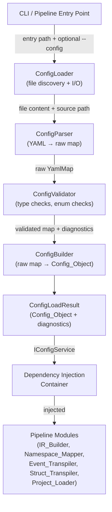
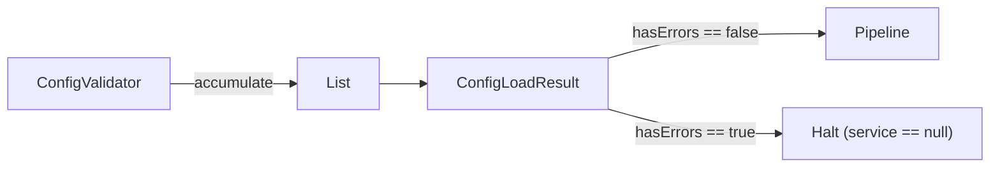

# Transpiler Configuration Service — Design Document

## Overview

The Configuration Service (`Config_Service`) is the single authoritative source of configuration for the entire C# → Dart transpiler pipeline. It locates, parses, validates, and exposes `transpiler.yaml` to all pipeline modules through a stable, strongly-typed interface. No pipeline module may read `transpiler.yaml` directly.

The service is constructed once at pipeline startup, performs all I/O and validation eagerly, and then exposes pure, side-effect-free accessors for the lifetime of the pipeline run. This design ensures determinism: the same `transpiler.yaml` content always produces the same `Config_Object` and the same set of diagnostics.

### Key Design Decisions

- **Eager loading**: All parsing and validation happens in the constructor/factory, not lazily. This surfaces errors before any pipeline module starts.
- **Result-based error handling**: The service returns a `ConfigLoadResult` (config + diagnostics) rather than throwing exceptions, enabling structured diagnostic reporting.
- **Immutable value objects**: All config sections are immutable Dart classes. Once constructed, a `Config_Object` cannot change.
- **Dependency injection**: `IConfigService` is injected into pipeline modules; no module holds a reference to the concrete `ConfigService` or to any file path.
- **YAML 1.2 compliance**: Uses the `yaml` Dart package (which implements YAML 1.2) for parsing.

---

## Architecture



### Component Responsibilities

| Component | Responsibility |
|---|---|
| `ConfigLoader` | File discovery (walk directories), reads file bytes, handles missing-file cases |
| `ConfigParser` | Invokes the `yaml` package, catches `YamlException`, maps parse errors to `ConfigDiagnostic` |
| `ConfigValidator` | Checks types, validates enum values, detects unknown keys, emits warnings/errors |
| `ConfigBuilder` | Constructs the strongly-typed `ConfigObject` from the validated map, applies defaults |
| `ConfigService` | Implements `IConfigService`; wraps `ConfigObject`; exposes pure accessors |
| `ConfigLoadResult` | Data class holding `ConfigObject?` and `List<ConfigDiagnostic>` |

---

## Components and Interfaces

### `IConfigService`

The public contract consumed by all pipeline modules. All methods are pure getters — no I/O, no side effects.

```dart
abstract interface class IConfigService {
  // LINQ
  LinqStrategy get linqStrategy;

  // Nullability
  NullabilityConfig get nullability;

  // Async
  AsyncConfig get asyncBehavior;

  // Namespace mapping
  Map<String, String> get namespaceMappings;
  String? get rootNamespace;
  bool get barrelFiles;
  Map<String, String> get namespacePrefixAliases;
  bool get autoResolveConflicts;

  // Events
  EventStrategy get eventStrategy;
  Map<String, EventMappingOverride> get eventMappings;

  // NuGet / packages
  Map<String, String> get packageMappings;
  String? get sdkPath;
  List<String> get nugetFeedUrls;

  // NuGet advanced configuration
  Map<String, dynamic> get nugetMappings;
  String? get nugetCachePath;
  List<String> get tier2SourcePaths;
  List<String> get excludePackages;
  Map<String, int> get forceTier;
  bool get transpileTier2;
  String? get mappingRegistryPath;

  // Type mappings
  Map<String, String> get libraryMappings;
  Map<String, StructMappingOverride> get structMappings;

  // Naming
  NamingConventions get namingConventions;

  // Feature flags
  Map<String, bool> get experimentalFeatures;

  // Resolved config object (for Load_Result)
  ConfigObject get config;
}
```

### `ConfigService`

Concrete implementation of `IConfigService`. Constructed by `ConfigLoader` pipeline; not instantiated directly by consumers.

```dart
final class ConfigService implements IConfigService {
  final ConfigObject _config;

  const ConfigService(this._config);

  @override
  LinqStrategy get linqStrategy => _config.linqStrategy;

  // ... delegates all accessors to _config
}
```

### `ConfigLoader`

Responsible for file discovery and reading. Returns a `ConfigLoadResult`.

```dart
final class ConfigLoader {
  /// Primary entry point. Discovers and loads transpiler.yaml.
  ///
  /// [entryPath] is the .csproj or .sln file path.
  /// [explicitConfigPath] is the value of --config, if provided.
  static Future<ConfigLoadResult> load({
    required String entryPath,
    String? explicitConfigPath,
  });
}
```

### `ConfigParser`

Wraps the `yaml` package. Returns either a `YamlMap` or a parse-error diagnostic.

```dart
final class ConfigParser {
  static ({YamlMap? map, ConfigDiagnostic? error}) parse(
    String content,
    String sourcePath,
  );
}
```

### `ConfigValidator`

Validates the raw `YamlMap` against the schema. Returns a list of diagnostics and a cleaned map.

```dart
final class ConfigValidator {
  static ({Map<String, dynamic> cleaned, List<ConfigDiagnostic> diagnostics})
      validate(YamlMap raw, String sourcePath);
}
```

### `ConfigBuilder`

Constructs the immutable `ConfigObject` from the validated map, applying defaults for missing keys.

```dart
final class ConfigBuilder {
  static ConfigObject build(Map<String, dynamic> validated);
}
```

### `ConfigLoadResult`

Returned by `ConfigLoader.load`. Carries both the service and all diagnostics.

```dart
final class ConfigLoadResult {
  /// Null when any Error-severity diagnostic is present.
  final IConfigService? service;

  /// The resolved config object (default config when no file found, null when parse failed).
  final ConfigObject? config;

  final List<ConfigDiagnostic> diagnostics;

  bool get hasErrors => diagnostics.any((d) => d.severity == DiagnosticSeverity.error);

  const ConfigLoadResult({
    required this.service,
    required this.config,
    required this.diagnostics,
  });
}
```

---

## Data Models

### `ConfigObject`

The immutable, strongly-typed in-memory representation of `transpiler.yaml`.

```dart
final class ConfigObject {
  final LinqStrategy linqStrategy;
  final NullabilityConfig nullability;
  final AsyncConfig asyncBehavior;
  final Map<String, String> namespaceMappings;
  final String? rootNamespace;
  final bool barrelFiles;
  final Map<String, String> namespacePrefixAliases;
  final bool autoResolveConflicts;
  final EventStrategy eventStrategy;
  final Map<String, EventMappingOverride> eventMappings;
  final Map<String, String> packageMappings;
  final String? sdkPath;
  final List<String> nugetFeedUrls;
  final Map<String, dynamic> nugetMappings;
  final String? nugetCachePath;
  final List<String> tier2SourcePaths;
  final List<String> excludePackages;
  final Map<String, int> forceTier;
  final bool transpileTier2;
  final String? mappingRegistryPath;
  final Map<String, String> libraryMappings;
  final Map<String, StructMappingOverride> structMappings;
  final NamingConventions namingConventions;
  final Map<String, bool> experimentalFeatures;

  const ConfigObject({
    this.linqStrategy = LinqStrategy.preserveFunctional,
    this.nullability = const NullabilityConfig(),
    this.asyncBehavior = const AsyncConfig(),
    this.namespaceMappings = const {},
    this.rootNamespace,
    this.barrelFiles = false,
    this.namespacePrefixAliases = const {},
    this.autoResolveConflicts = false,
    this.eventStrategy = EventStrategy.stream,
    this.eventMappings = const {},
    this.packageMappings = const {},
    this.sdkPath,
    this.nugetFeedUrls = const ['https://api.nuget.org/v3/index.json'],
    this.nugetMappings = const {},
    this.nugetCachePath,
    this.tier2SourcePaths = const [],
    this.excludePackages = const [],
    this.forceTier = const {},
    this.transpileTier2 = true,
    this.mappingRegistryPath,
    this.libraryMappings = const {},
    this.structMappings = const {},
    this.namingConventions = const NamingConventions(),
    this.experimentalFeatures = const {},
  });

  /// Returns a ConfigObject with all fields at their documented default values.
  static const ConfigObject defaults = ConfigObject();

  /// Value equality
  @override
  bool operator ==(Object other) { ... }

  @override
  int get hashCode { ... }
}
```

### Enums

```dart
enum LinqStrategy {
  preserveFunctional,  // YAML: "preserve_functional"
  lowerToLoops,        // YAML: "lower_to_loops"
}

enum EventStrategy {
  stream,    // YAML: "stream"
}

enum CaseStyle {
  pascalCase,          // YAML: "PascalCase"
  camelCase,           // YAML: "camelCase"
  snakeCase,           // YAML: "snake_case"
  screamingSnakeCase,  // YAML: "SCREAMING_SNAKE_CASE"
}

enum DiagnosticSeverity { error, warning, info }
```

### Value Objects

```dart
final class NullabilityConfig {
  final bool treatNullableAsOptional;   // default: false
  final bool emitNullAsserts;           // default: false
  final bool preserveNullableAnnotations; // default: true

  const NullabilityConfig({
    this.treatNullableAsOptional = false,
    this.emitNullAsserts = false,
    this.preserveNullableAnnotations = true,
  });

  @override bool operator ==(Object other) { ... }
  @override int get hashCode { ... }
}

final class AsyncConfig {
  final bool omitConfigureAwait;    // default: false
  final bool mapValueTaskToFuture;  // default: true
  final bool wrapUnawaitedVoid;     // default: true

  const AsyncConfig({
    this.omitConfigureAwait = false,
    this.mapValueTaskToFuture = true,
    this.wrapUnawaitedVoid = true,
  });

  @override bool operator ==(Object other) { ... }
  @override int get hashCode { ... }
}

final class NamingConventions {
  final CaseStyle classNameStyle;   // default: PascalCase
  final CaseStyle methodNameStyle;  // default: camelCase
  final CaseStyle fieldNameStyle;   // default: camelCase
  final CaseStyle fileNameStyle;    // default: snake_case
  final String privatePrefix;       // default: "_"

  const NamingConventions({
    this.classNameStyle = CaseStyle.pascalCase,
    this.methodNameStyle = CaseStyle.camelCase,
    this.fieldNameStyle = CaseStyle.camelCase,
    this.fileNameStyle = CaseStyle.snakeCase,
    this.privatePrefix = '_',
  });

  @override bool operator ==(Object other) { ... }
  @override int get hashCode { ... }
}

final class EventMappingOverride {
  final EventStrategy? strategy;
  final String? dartEventName;

  const EventMappingOverride({this.strategy, this.dartEventName});

  @override bool operator ==(Object other) { ... }
  @override int get hashCode { ... }
}

final class StructMappingOverride {
  final String? dartType;
  final String? dartPackage;

  const StructMappingOverride({this.dartType, this.dartPackage});

  @override bool operator ==(Object other) { ... }
  @override int get hashCode { ... }
}
```

### `ConfigDiagnostic`

```dart
final class ConfigDiagnostic {
  final DiagnosticSeverity severity;
  final String code;          // e.g. "CFG0001"
  final String message;
  final SourceLocation? location;

  const ConfigDiagnostic({
    required this.severity,
    required this.code,
    required this.message,
    this.location,
  });

  @override bool operator ==(Object other) { ... }
  @override int get hashCode { ... }
}

final class SourceLocation {
  final String filePath;
  final int line;
  final int column;

  const SourceLocation({
    required this.filePath,
    required this.line,
    required this.column,
  });

  @override bool operator ==(Object other) { ... }
  @override int get hashCode { ... }
}
```

### Diagnostic Code Registry

| Code | Severity | Trigger |
|---|---|---|
| `CFG0001` | Error | Explicit `--config` path does not exist |
| `CFG0002` | Error | YAML syntax error (invalid YAML) |
| `CFG0003` | Error | Type mismatch for a recognized key |
| `CFG0004` | Error | Invalid enum value (e.g. unknown `linq_strategy`) |
| `CFG0010` | Warning | Unrecognized top-level key |
| `CFG0011` | Warning | Unrecognized key under `nullability` section |
| `CFG0012` | Warning | Unrecognized key under `async_behavior` section |
| `CFG0013` | Warning | Unrecognized key under `naming_conventions` section |
| `CFG0020` | Info | Config file not found; using all defaults |

---

## File Discovery Algorithm

The discovery algorithm is deterministic and side-effect-free once the filesystem is abstracted.

```
function discoverConfigFile(entryPath, explicitConfigPath):
  if explicitConfigPath is not null:
    if file_exists(explicitConfigPath):
      return explicitConfigPath
    else:
      emit CFG0001 (Error)
      return null

  searchDir = directory_of(entryPath)
  loop:
    candidate = join(searchDir, "transpiler.yaml")
    if file_exists(candidate):
      return candidate
    parent = parent_directory(searchDir)
    if parent == searchDir:          // reached filesystem root
      break
    searchDir = parent

  // No file found — use defaults
  emit CFG0020 (Info)
  return null
```

Key properties of this algorithm:
- Terminates because the directory chain is finite (bounded by filesystem depth).
- The explicit-path branch short-circuits the walk entirely.
- A missing file is not an error; it produces an Info diagnostic and a default `ConfigObject`.

---

## YAML Parsing Approach

The service uses the [`yaml`](https://pub.dev/packages/yaml) Dart package (YAML 1.2 compliant).

### Parsing Pipeline

1. **Read bytes** — `ConfigLoader` reads the file as UTF-8 string.
2. **Parse YAML** — `ConfigParser` calls `loadYaml(content)`. On `YamlException`, emits `CFG0002` with line/column from the exception and returns null.
3. **Type-check top-level keys** — `ConfigValidator` iterates the `YamlMap`. For each key:
   - If unrecognized → `CFG0010` Warning, skip.
   - If recognized but wrong type → `CFG0003` Error.
   - If recognized enum field with invalid value → `CFG0004` Error.
4. **Recurse into sections** — Each section (e.g., `nullability`, `async_behavior`) is validated by a dedicated sub-validator that emits section-specific warning codes (`CFG0011`, `CFG0012`, `CFG0013`) for unknown keys.
5. **Build** — `ConfigBuilder.build()` constructs the `ConfigObject` from the cleaned map, substituting defaults for absent keys.

### Serialization (for round-trip)

`ConfigObject` exposes a `toYamlMap()` method that produces a `Map<String, dynamic>` suitable for serialization back to YAML using the `yaml_writer` package. This enables the round-trip property tests.

```dart
extension ConfigObjectSerialization on ConfigObject {
  Map<String, dynamic> toYamlMap() { ... }
}
```

---

## Diagnostics System Design

### Design Principles

- **Aggregation over fail-fast**: The validator collects all diagnostics in a single pass rather than stopping at the first error. This gives developers a complete picture of all problems in one run.
- **No stdout/stderr**: Diagnostics are returned in `ConfigLoadResult.diagnostics`, never written to standard output by the service itself. The CLI layer decides how to render them.
- **Deduplication**: The validator tracks `(code, location)` pairs and skips duplicates before adding to the list.
- **Halt on Error**: `ConfigLoadResult.service` is null when any Error-severity diagnostic is present. The pipeline checks `hasErrors` before proceeding.

### Diagnostic Flow



### Deduplication Strategy

The validator maintains a `Set<(String code, SourceLocation? location)>` during validation. Before appending a new diagnostic, it checks membership. This prevents duplicate warnings when, for example, the same unknown key appears in multiple YAML anchors.

---

## Dependency Injection Integration

The `IConfigService` is registered in the DI container at pipeline startup, before any pipeline module is constructed.

### Registration Pattern (pseudo-Dart using a simple service locator or `get_it`)

```dart
Future<void> bootstrapPipeline({
  required String entryPath,
  String? explicitConfigPath,
}) async {
  final result = await ConfigLoader.load(
    entryPath: entryPath,
    explicitConfigPath: explicitConfigPath,
  );

  // Report diagnostics via CLI renderer
  for (final diag in result.diagnostics) {
    DiagnosticRenderer.render(diag);
  }

  if (result.hasErrors) {
    exit(1);
  }

  // Register the service
  getIt.registerSingleton<IConfigService>(result.service!);

  // Pipeline modules receive IConfigService via constructor injection
  final irBuilder = IrBuilder(config: getIt<IConfigService>());
  final namespaceMapper = NamespaceMapper(config: getIt<IConfigService>());
  // ...
}
```

### Rules

- `IConfigService` is registered as a **singleton** — one instance per pipeline run.
- Pipeline modules declare `IConfigService` in their constructors; they never call `ConfigLoader` or read YAML.
- Tests inject a `FakeConfigService` or a `ConfigService` built from an in-memory YAML string.

---

## Correctness Properties

*A property is a characteristic or behavior that should hold true across all valid executions of a system — essentially, a formal statement about what the system should do. Properties serve as the bridge between human-readable specifications and machine-verifiable correctness guarantees.*

The Config_Service is a pure data-transformation pipeline (file content → typed object), making it well-suited for property-based testing. The properties below are derived from the acceptance criteria in Requirements 2, 7, 9, 10, and 11.

**Property Reflection notes:**
- Requirements 2.6 and 9.4 both state the round-trip property from different perspectives; they are consolidated into Property 1.
- Requirement 10.1 (linq default) is a specific instance of the general default-value property (Requirement 11.3); consolidated into Property 3.
- Requirements 11.4 and 7.3 (no duplicates) are distinct concerns and kept separate.

---

### Property 1: Config round-trip

*For any* valid `ConfigObject`, serializing it to a YAML map and then parsing that YAML map SHALL produce a `ConfigObject` that is value-equal to the original.

**Validates: Requirements 2.6, 9.4**

---

### Property 2: Parsing determinism

*For any* valid `transpiler.yaml` file content string, parsing it twice in sequence SHALL produce two `ConfigObject` instances that are value-equal.

**Validates: Requirement 11.2**

---

### Property 3: Default values for absent keys

*For any* subset of recognized config keys, a `transpiler.yaml` that omits those keys SHALL produce a `ConfigObject` where every accessor for an omitted key returns the documented `Default_Value` for that key.

**Validates: Requirements 11.3, 10.1, 10.2, 10.3**

---

### Property 4: Clean config produces no errors or warnings

*For any* `transpiler.yaml` that contains only recognized keys with values of the correct type and valid enum values, the `ConfigLoadResult` SHALL contain zero `ConfigDiagnostic` entries with severity `Error` or `Warning`.

**Validates: Requirements 11.4, 11.5**

---

### Property 5: No duplicate diagnostics

*For any* `transpiler.yaml` content (valid or invalid), the list of `ConfigDiagnostic` entries in `ConfigLoadResult` SHALL contain no two entries with the same `(code, location)` pair.

**Validates: Requirement 7.3**

---

### Property 6: Invalid enum value produces an error diagnostic

*For any* string that is not a member of the `LinqStrategy` enum's recognized YAML values (`"lower_to_loops"`, `"preserve_functional"`), a `transpiler.yaml` with that string as the `linq_strategy` value SHALL produce a `ConfigDiagnostic` of severity `Error` with code `CFG0004`.

**Validates: Requirement 10.4**

---

### Property 7: Unrecognized top-level key produces a warning diagnostic

*For any* string that is not a recognized top-level key in the `transpiler.yaml` schema, a `transpiler.yaml` containing that key SHALL produce a `ConfigDiagnostic` of severity `Warning` with code `CFG0010`, and parsing SHALL continue (no Error emitted solely due to the unknown key).

**Validates: Requirement 2.5**

---

### Property 8: Type safety of all accessors

*For any* valid `ConfigObject` (produced from a valid `transpiler.yaml`), calling every accessor on the corresponding `IConfigService` SHALL return a non-null value of the documented type without throwing an exception.

**Validates: Requirement 11.1**

---

## Error Handling

### Error Categories and Responses

| Category | Diagnostic | Pipeline Behavior |
|---|---|---|
| Explicit config path missing | `CFG0001` Error | `service == null`, pipeline halts |
| Invalid YAML syntax | `CFG0002` Error | `service == null`, pipeline halts |
| Type mismatch on recognized key | `CFG0003` Error | `service == null`, pipeline halts |
| Invalid enum value | `CFG0004` Error | `service == null`, pipeline halts |
| Unrecognized top-level key | `CFG0010` Warning | Parsing continues, key ignored |
| Unrecognized key in `nullability` | `CFG0011` Warning | Parsing continues, key ignored |
| Unrecognized key in `async_behavior` | `CFG0012` Warning | Parsing continues, key ignored |
| Unrecognized key in `naming_conventions` | `CFG0013` Warning | Parsing continues, key ignored |
| Config file not found | `CFG0020` Info | Default `ConfigObject` returned, pipeline proceeds |

### Error Propagation Rules

1. The `ConfigLoader` never throws. All errors are captured as `ConfigDiagnostic` entries.
2. `ConfigLoadResult.hasErrors` is the single gate: if true, `service` is null and the pipeline must not proceed.
3. Warnings and Info diagnostics do not block the pipeline.
4. The CLI layer (not the Config_Service) is responsible for rendering diagnostics to the terminal.

### Exception Handling in ConfigParser

```dart
static ({YamlMap? map, ConfigDiagnostic? error}) parse(
  String content,
  String sourcePath,
) {
  try {
    final doc = loadYaml(content);
    if (doc == null) return (map: YamlMap(), error: null);
    if (doc is! YamlMap) {
      return (map: null, error: ConfigDiagnostic(
        severity: DiagnosticSeverity.error,
        code: 'CFG0002',
        message: 'transpiler.yaml must be a YAML mapping at the top level',
        location: SourceLocation(filePath: sourcePath, line: 1, column: 1),
      ));
    }
    return (map: doc, error: null);
  } on YamlException catch (e) {
    return (map: null, error: ConfigDiagnostic(
      severity: DiagnosticSeverity.error,
      code: 'CFG0002',
      message: 'YAML syntax error: ${e.message}',
      location: SourceLocation(
        filePath: sourcePath,
        line: e.span?.start.line ?? 0,
        column: e.span?.start.column ?? 0,
      ),
    ));
  }
}
```

---

## Testing Strategy

### Dual Testing Approach

The Config_Service uses both unit/example-based tests and property-based tests. They are complementary:

- **Unit tests** verify specific examples, edge cases, and error conditions with concrete inputs.
- **Property tests** verify universal invariants across a wide range of generated inputs.

### Property-Based Testing Library

The implementation uses [`package:test`](https://pub.dev/packages/test) for the test runner and [`package:fast_check`](https://pub.dev/packages/fast_check) (or [`package:glados`](https://pub.dev/packages/glados)) for property-based testing in Dart. Each property test runs a minimum of **100 iterations**.

Each property test is tagged with a comment referencing the design property:
```
// Feature: transpiler-configuration, Property N: <property text>
```

### Generators

The following generators are needed for property tests:

```dart
// Generates a random valid ConfigObject
Arbitrary<ConfigObject> validConfigObject();

// Generates a random valid transpiler.yaml content string
Arbitrary<String> validYamlContent();

// Generates a random subset of recognized config keys (for default-value tests)
Arbitrary<Set<String>> recognizedKeySubset();

// Generates a random string that is NOT a valid LinqStrategy value
Arbitrary<String> invalidLinqStrategyValue();

// Generates a random string that is NOT a recognized top-level key
Arbitrary<String> unknownTopLevelKey();
```

### Property Test Implementations

```dart
// Feature: transpiler-configuration, Property 1: Config round-trip
test('round-trip: serialize then parse produces value-equal ConfigObject', () {
  forAll(validConfigObject(), (original) {
    final yaml = original.toYamlMap();
    final content = serializeToYamlString(yaml);
    final result = ConfigParser.parse(content, 'test.yaml');
    final rebuilt = ConfigBuilder.build(result.map!);
    expect(rebuilt, equals(original));
  });
});

// Feature: transpiler-configuration, Property 2: Parsing determinism
test('determinism: parsing same content twice yields equal ConfigObjects', () {
  forAll(validYamlContent(), (content) {
    final r1 = ConfigBuilder.build(ConfigParser.parse(content, 'f').map!);
    final r2 = ConfigBuilder.build(ConfigParser.parse(content, 'f').map!);
    expect(r1, equals(r2));
  });
});

// Feature: transpiler-configuration, Property 3: Default values for absent keys
test('defaults: omitted keys return documented default values', () {
  forAll(recognizedKeySubset(), (omittedKeys) {
    final yaml = buildYamlOmitting(omittedKeys);
    final config = ConfigBuilder.build(ConfigParser.parse(yaml, 'f').map!);
    for (final key in omittedKeys) {
      expect(config.valueForKey(key), equals(ConfigObject.defaults.valueForKey(key)));
    }
  });
});

// Feature: transpiler-configuration, Property 4: Clean config produces no errors or warnings
test('clean config: valid YAML produces zero Error/Warning diagnostics', () {
  forAll(validConfigObject(), (obj) {
    final yaml = serializeToYamlString(obj.toYamlMap());
    final result = ConfigValidator.validate(
      ConfigParser.parse(yaml, 'f').map!, 'f');
    final errorsOrWarnings = result.diagnostics.where(
      (d) => d.severity == DiagnosticSeverity.error ||
             d.severity == DiagnosticSeverity.warning);
    expect(errorsOrWarnings, isEmpty);
  });
});

// Feature: transpiler-configuration, Property 5: No duplicate diagnostics
test('no duplicate diagnostics: (code, location) pairs are unique', () {
  forAll(anyYamlContent(), (content) {
    final result = /* full load pipeline */;
    final seen = <(String, SourceLocation?)>{};
    for (final d in result.diagnostics) {
      final key = (d.code, d.location);
      expect(seen.contains(key), isFalse);
      seen.add(key);
    }
  });
});

// Feature: transpiler-configuration, Property 6: Invalid enum value produces CFG0004
test('invalid enum: unrecognized linq_strategy emits CFG0004 Error', () {
  forAll(invalidLinqStrategyValue(), (badValue) {
    final yaml = 'linq_strategy: $badValue\n';
    final result = /* full load pipeline */;
    expect(result.diagnostics.any(
      (d) => d.code == 'CFG0004' && d.severity == DiagnosticSeverity.error),
      isTrue);
  });
});

// Feature: transpiler-configuration, Property 7: Unknown key produces CFG0010 Warning
test('unknown key: unrecognized top-level key emits CFG0010 Warning', () {
  forAll(unknownTopLevelKey(), (key) {
    final yaml = '$key: some_value\n';
    final result = /* full load pipeline */;
    expect(result.diagnostics.any(
      (d) => d.code == 'CFG0010' && d.severity == DiagnosticSeverity.warning),
      isTrue);
    expect(result.hasErrors, isFalse);
  });
});

// Feature: transpiler-configuration, Property 8: Type safety of all accessors
test('type safety: all accessors return correct types without throwing', () {
  forAll(validConfigObject(), (obj) {
    final service = ConfigService(obj);
    expect(() {
      service.linqStrategy;
      service.nullability;
      service.asyncBehavior;
      service.namespaceMappings;
      service.rootNamespace;
      service.barrelFiles;
      service.namespacePrefixAliases;
      service.autoResolveConflicts;
      service.eventStrategy;
      service.eventMappings;
      service.packageMappings;
      service.sdkPath;
      service.nugetFeedUrls;
      service.libraryMappings;
      service.structMappings;
      service.namingConventions;
      service.experimentalFeatures;
    }, returnsNormally);
  });
});
```

### Unit / Example Tests

In addition to property tests, the following example-based tests cover specific scenarios:

| Test | Covers |
|---|---|
| Missing explicit `--config` path emits `CFG0001` | Requirement 1.5 |
| No `transpiler.yaml` found → default `ConfigObject` returned | Requirement 1.3 |
| `transpiler.yaml` in parent directory is found | Requirement 1.2 |
| Invalid YAML syntax emits `CFG0002` with line/column | Requirement 2.3 |
| Type mismatch (string for bool) emits `CFG0003` | Requirement 2.4 |
| Empty `transpiler.yaml` → all defaults | Requirement 11.3 |
| `linq_strategy: lower_to_loops` → `LinqStrategy.lowerToLoops` | Requirement 10.2 |
| `preserveNullableAnnotations: false` → documented behavior | Requirement 4.2 |
| `ConfigLoadResult.service` is null when errors present | Requirement 7.4 |
| `ConfigLoadResult.service` is non-null when only warnings | Requirement 7.5 |
| `Load_Result.Config` equals `IConfigService` accessors | Requirement 9.2 |

### Test File Structure

```
test/
  config/
    config_loader_test.dart       # File discovery, I/O
    config_parser_test.dart       # YAML parsing, error cases
    config_validator_test.dart    # Type checks, enum checks, unknown keys
    config_builder_test.dart      # Default values, field mapping
    config_service_test.dart      # IConfigService accessor delegation
    config_properties_test.dart   # All 8 property-based tests
    generators/
      config_generators.dart      # Arbitrary<ConfigObject>, Arbitrary<String>, etc.
```
